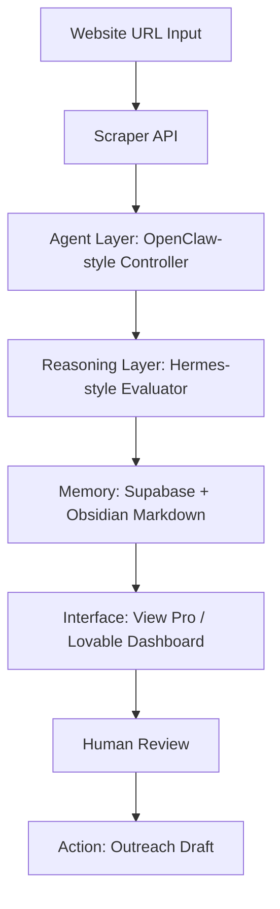

# Agentic Lead Intel System

A deployable AI workflow MVP that turns a local business website URL into a structured lead profile, web presence assessment, memory record, and human-reviewed outreach draft.

This project is designed as recruiter-facing proof of work for agentic AI implementation roles. It demonstrates scraping, agent orchestration, reasoning, persistent memory, human-in-the-loop review, and business-action generation.

---

## Live Workflow



---

## What This Proves

This system shows that the builder understands:

- Agentic workflow design
- Tool-using AI systems
- Web scraping for business intelligence
- Human-in-the-loop approval
- Persistent operational memory
- Structured JSON outputs
- Recruiter-readable technical documentation
- Deployment-ready backend architecture
- Business outcome mapping

---

## Core Use Case

A user enters a business website URL.

The system:

1. Scrapes the page.
2. Extracts business identity signals.
3. Scores website quality.
4. Identifies improvement opportunities.
5. Generates a structured lead profile.
6. Saves the profile to persistent memory.
7. Creates an Obsidian-style markdown note.
8. Drafts outreach for human review.
9. Exposes everything through a clean API for a frontend dashboard.

---

## Tech Stack

| Layer | Implementation |
|---|---|
| Interface | Lovable / View Pro frontend |
| Backend | Node.js + Express |
| Scraper | Firecrawl API, with local fallback |
| Agent Layer | OpenClaw-style orchestration controller |
| Reasoning | OpenAI-compatible API, with deterministic fallback |
| Memory | Supabase Postgres |
| Markdown Memory | Obsidian-style generated notes |
| Deployment | Render, Railway, or Vercel-compatible backend |
| Portfolio | GitHub README + demo script |

---

## Repository Structure

```text
agentic-lead-intel-system/
├── backend/
│   ├── src/
│   │   ├── agents.js
│   │   ├── config.js
│   │   ├── memory.js
│   │   ├── reasoning.js
│   │   ├── scraper.js
│   │   ├── server.js
│   │   └── validators.js
│   ├── package.json
│   ├── .env.example
│   └── README.md
├── supabase/
│   └── schema.sql
├── lovable/
│   └── lovable-prompt.md
├── docs/
│   ├── architecture.md
│   ├── deployment-ipad.md
│   ├── recruiter-demo-script.md
│   └── security-and-ethics.md
├── sample-output/
│   ├── sample-lead-analysis.json
│   └── sample-obsidian-note.md
└── README.md
```

---

## API Endpoints

### Health Check

```http
GET /health
```

### Run Full Lead Analysis

```http
POST /api/analyze
Content-Type: application/json

{
  "url": "https://example-business.com",
  "businessName": "Example Business",
  "location": "Kansas City, MO"
}
```

### List Leads

```http
GET /api/leads
```

### Read One Lead

```http
GET /api/leads/:id
```

### Approve Outreach Draft

```http
POST /api/leads/:id/approve
```

---

## Environment Variables

Copy `backend/.env.example` to `.env`.

```bash
PORT=3000
NODE_ENV=development

SUPABASE_URL=
SUPABASE_SERVICE_ROLE_KEY=

FIRECRAWL_API_KEY=

OPENAI_API_KEY=
OPENAI_MODEL=gpt-4.1-mini
OPENAI_BASE_URL=https://api.openai.com/v1

DEMO_MODE=true
```

If API keys are missing, the app still runs in demo mode using deterministic fallback logic. This makes it safe for recruiters to test without breaking the demo.

---

## Recruiter Demo Narrative

> “This is an AI lead intelligence workflow. It scrapes a business website, routes the content through an agent controller, applies a reasoning layer to identify business opportunities, stores the analysis as memory, and generates a human-reviewed outreach draft. I designed the system to show practical agentic implementation, not just prompting.”

---

## Quick Start

```bash
cd backend
npm install
npm run dev
```

Then test:

```bash
curl http://localhost:3000/health
```

Run an analysis:

```bash
curl -X POST http://localhost:3000/api/analyze \
  -H "Content-Type: application/json" \
  -d '{"url":"https://example.com","businessName":"Example Business","location":"Kansas City, MO"}'
```

---

## Deployment

See [`docs/deployment-ipad.md`](docs/deployment-ipad.md).

---

## Design Philosophy

The system is intentionally modular:

- The scraper can be swapped from Firecrawl to Apify, Browserless, Playwright, or native fetch.
- The reasoning model can be OpenAI, OpenRouter, local Hermes, or any OpenAI-compatible endpoint.
- The memory layer can be Supabase, Obsidian markdown, or both.
- The interface can be Lovable, View Pro, Next.js, or Retool.

That modularity is the point: this is not a toy prompt chain. It is an implementation pattern for AI-orchestrated business workflows.

---

## Status

MVP-ready. Built for recruiter demonstration, live deployment, and future extension.
