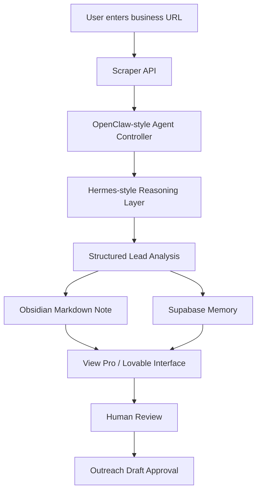

# Architecture

## System Goal

Convert a business website URL into an actionable AI-generated lead intelligence record.

## Architecture Diagram



## Components

### Scraper

Responsible for transforming public website content into model-readable text.

Primary implementation:

- Firecrawl API

Fallback implementation:

- Native fetch
- HTML-to-text extraction
- Demo-safe deterministic content

### Agent Layer

The OpenClaw-style controller coordinates the workflow.

Responsibilities:

- Validate input
- Call scraper
- Extract business signals
- Prepare reasoning payload
- Create outreach draft
- Generate memory note
- Save record

### Reasoning Layer

The Hermes-style reasoning layer evaluates:

- Website quality
- Local SEO signals
- Conversion path
- Trust signals
- Offer fit
- Outreach strategy

The production path uses an OpenAI-compatible API. The fallback path uses deterministic rule-based scoring so the demo remains functional.

### Memory Layer

Two memory formats are used:

1. Supabase structured memory
2. Obsidian-style markdown note

This shows both operational persistence and human-readable memory.

### Human Review

Outreach is never automatically sent.

The system creates a draft and marks it:

```text
pending_review
```

A human can approve it later.

This is deliberate. It demonstrates responsible automation.
